## Table of Contents
* [Purpose](#Purpose)
* [User Experience Design (UX)](#User-Experience-Design)
  * [User stories](#User-Stories)
    * [First Time Visitor Goals](#First-Time-Visitor-Goals)
    * [Returning Visitor Goals](#Returning-Visitor-Goals)
  * [Structure](#Structure)
  * [Design](#Design)
    * [Colour Scheme](#Colour-Scheme)
    * [Typography](#Typography)
    * [Imagery](#Imagery)
    * [Wireframes](#Wireframes)
    * [Differences to Design](Differences-to-Design)
* [Limitations](#Limitations)
- [Features](#Features)
    * [Existing Features](#Existing-Features)
    * [Future Features](#Features-Left-to-Implement)
* [Technologies](#Technologies)
* [Testing](#Testing)
    * [Test Strategy](#Test-Strategy)
      * [Summary](#Summary)
    * [Test Results](#Test-Results)
    * [Testing Issues](#Issues-and-Resolutions-to-issues-found-during-testing)
* [Deployment](#Deployment)
    * [Project Creation](#Project-Creation)
    * [GitHub Pages](#Using-Github-Pages)
    * [Locally](Run-Locally)
* [Credits](#Credits)
  * [Content](#Content)
  * [Media](#Media)
  * [Acknowledgements](#Acknowledgements)
  * [Comments](#Comments)

# Milestone Project 1
## Purpose
The website is meant to present and show off my father's craftsmanship to everybody. At the same time, it has been created for the sole purpose of completing the first Milestone Project for the Code Institute's Full Stack Developer course.
The knowledge gained from the HTML, CSS, and User Centric Design modules played a key role in developing the web page, even though a full list of the employed technologies can be found in the technologies section of this document.

The live website can be found [here](https://aelfrith92.github.io/cosmo-s-artworks/).

## Cosmo's Drawing - Responsive Website

My father - Cosimino Morieri, the client - always wished he had a personal website, to showcase his works to friends and acquaintances. As I had already developed fully responsive websites in the past, I started coding bearing the responsiveness in mind. There is no profit purpose behind this web page. The website will provide an essential overview about his works (what he does) and his background. 

*** 
## User Experience Design

### User stories
#### First Time Visitor Goals
* As a First Time user, I want to easily understand the main purpose of the site and learn more about the artist.
* As a First Time user, I want to be able to easily navigate throughout the site to find content.
* As a First Time user, I want to view the website and content clearly on my mobile device.
* As a First Time user, I want to find ways to follow Cosimino's activities on different social media platforms.
#### Returning and Frequent Visitor Goals
* As a Returning and Frequent user, I want to share the content with friends and have a look at the gallery.
* As a Returning user, I want to contact Cosimino, so I can request more information.

### Structure
The site contains just one single page for the time being. A gallery page will be added in the future, as the visual resources need a format conversion, in order to optimize data streaming and performance.

The Navigation Menu allows users to easily navigate the different sections of the web page, even on smaller devices thanks to the responsive and collapsable version of the same. It contains the icon chosen as website logo, retrieved by flaticon.com and fully licensed. Visit the folder "flaticon_licenses" within the root for further details. Same applies to the Burger Menu icon (further details about it in the following paragraphs), the wood icon, the iron icon, the email icon. No attribution is required.

The purpose of this is to fulfill the aforementioned user's story:
> As a First Time user, I want to be able to easily navigate throughout the site to find content.

The Home Page contains a brief overview about Cosimino's background and crafted works.
The purpose of this is to fulfill the aforementioned user's story:
> As a First Time user, I want to easily understand the main purpose of the site and learn more about the artist.

Custom CSS and Bootstrap 5.1.3 will be employed to make the Website responsive by the use of media queries, the Boostrap Grid system, and flexboxes CSS properties. All sections contain code that overrides Bootstrap pre-set style.

The main page (as well as the future gallery page) will be responsive. There is just one chosen layout breakpoint, which triggers the alternative views of contents, namely, 768px as maximum width. 
Images have been converted, scaled, and included in the code so that they are accessible and light, in terms of data streaming and performance. A minimum height and a responsive width have been set, so that they are still visible even at narrow viewport widths.
The purpose of this is to fulfill the aforementioned user's story:
> As a First Time user, I want to view the website and content clearly on my mobile device.

The main page will contain a Contact Us section, which will allow the user to reach out to Cosimino in an easy and straightforward way. All form elements are required, to submit a clear and comprehensive enquiry.
The purpose of this is to fulfill the aforementioned user's story:
> As a Returning user, I want to contact Cosimino, so I can request more information.

All pages will contain a Footer Element with Social Media Icons. The icons used will be
from font-awesome. These are referenced below in the Frameworks-Libraries-and-Programs-Used section of this document. 
The aim of the Footer elements are to fulfill the aforementioned user's story:
> As a First Time user, I want to find ways to follow Cosimino's activities on different social media platforms. 

The Gallery Page (to be developed) will contain a rich number of Cosimino's artworks, all designed by following the flexbox responsiveness layout showed [here](https://www.w3schools.com/css/css3_flexbox_responsive.asp).
The purpose of this is to fulfill the aforementioned user's story:
> As a Returning and Frequent user, I want to share the content with friends and have a look at the gallery.

### Design
#### Colour Palette
The main colours used have been mainly inspired by the Bootstrap [Warning theme](https://getbootstrap.com/docs/5.1/customize/color/), alongside a related color palette retrieved on colorhunt.co [here](https://colorhunt.co/palette/ffcc1d0b4619116530e8e8cc). Following my mentor's advice, I have replaced the color #116530 with a darker shade, to improve the contrast rate of text-background and - consequently - the experience for visually impaired users.
#### Typography
The headers on all pages throughout the Website are using:
- the **Montserrat** font as a global parameter;
- the **Roboto Condensed** font applied to h1, h2, and h3 tags;
- the **Ubuntu Condensed** font applied to the text next to the logo, to give it a unique and minimal style within the page. 
Fonts have been imported from Google Fonts website, using the @import instruction at the top of the custom style.css file.
#### Imagery
The Brand icon is fictional. I have employed an icon downloaded by flaticon.com which would have resembled my father's look somehow, namely, depicting a moustache. However, I am not the only one having the exclusive right to employ such an icon as a resource on one's website. I have chosen the svg format, as it renders an excellent quality with a minimal memory allocation.

As mentioned above and except for the social media icons in the footer which come from fontawesome, these icons have been downloaded from flaticon.com and are fully licensed.

Other pictures within the web page have been converted into a webp format, to optimize data streaming and performance.

#### Wireframes
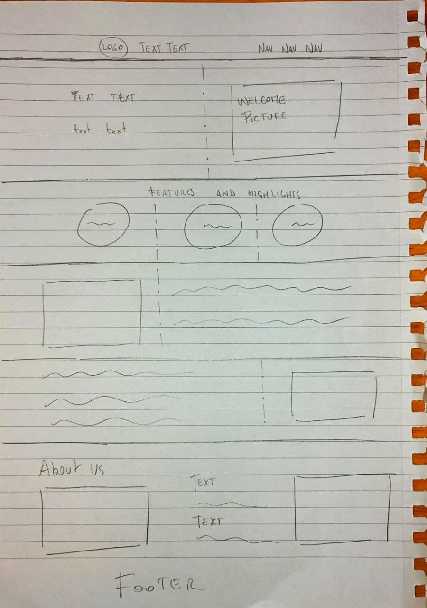 
I have drafted sections and content on a paper sheet and then I have developed the actual content by employing the following layout stratgies:
- [Bootstrap grid](https://getbootstrap.com/docs/5.1/layout/grid/);
- Custom CSS;
- [Flexbox responsivness](https://www.w3schools.com/css/css3_flexbox_responsive.asp).

Before adding content in each section, I firstly use to assigning different background colours to the containers, to see their behaviour. Once they meet my expectations, I add the content.

#### Differences to Design
In the original design, multiple pages had been projected. After the second session witht the mentor, we came to the conclusion that a single page could have met all needs. The bottom part of the page was not completely clear in the wireframing step, so it may differ from the one depicted.
### Limitations
Due to no JavaScript functionality, apart from Bootstraps(JS/JQuery), the contact form will not store data or send email requests. Due to other reasons, the gallery page has been postponed, as a hundred of photos need to be converted and scaled. Initially, a Bootstrap carousel had to be inmplemented, but it is now a pending feature.
***
## Features
 
### Existing Features
- The Welcome picture is linked to an animation
- Each section is responsive
- The contact form lets the user reach out to Cosimino with any queries they may have
- Sections are presented with an alternated colour pattern

- The Header section includes a navigation menu (with a fictional logo), a welcome message and a welcome animated picture which lets the user get an idea of Cosimino's activity:
  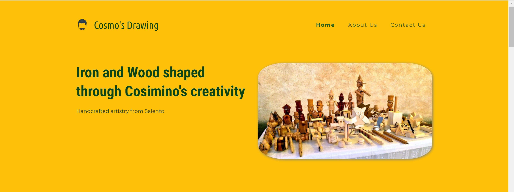
- The Features section aims at catching the attention of lazy users in a nutshell, by describing the uniqueness of Cosimino's works:
  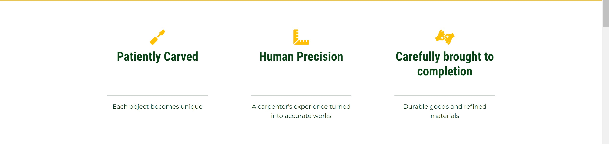
- The following sections present the user with different categories of artworks made by Cosimino:
  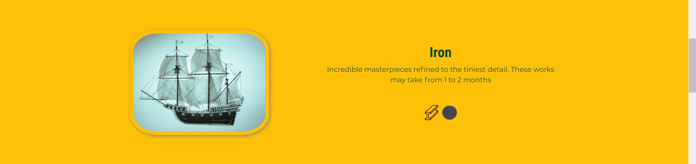
- After the categories, a brief desciption about Cosimino's background is provided:
  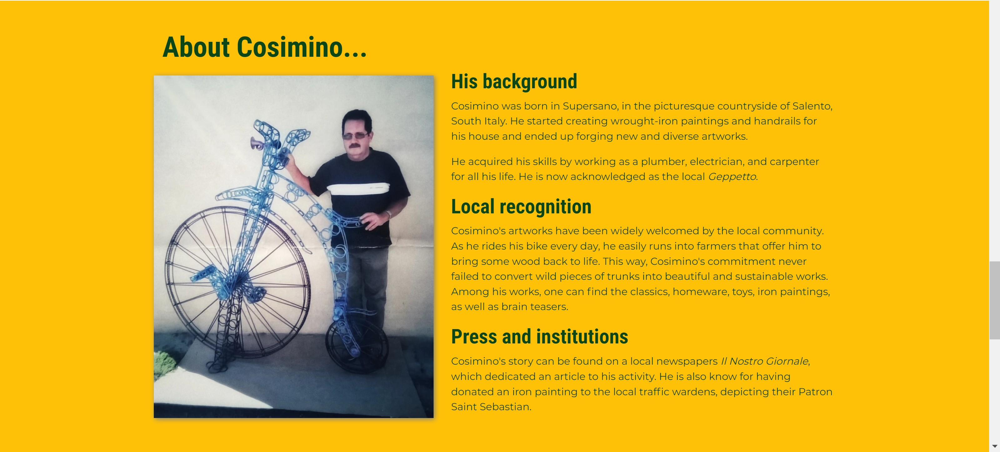
- The contact form comes straight after:
	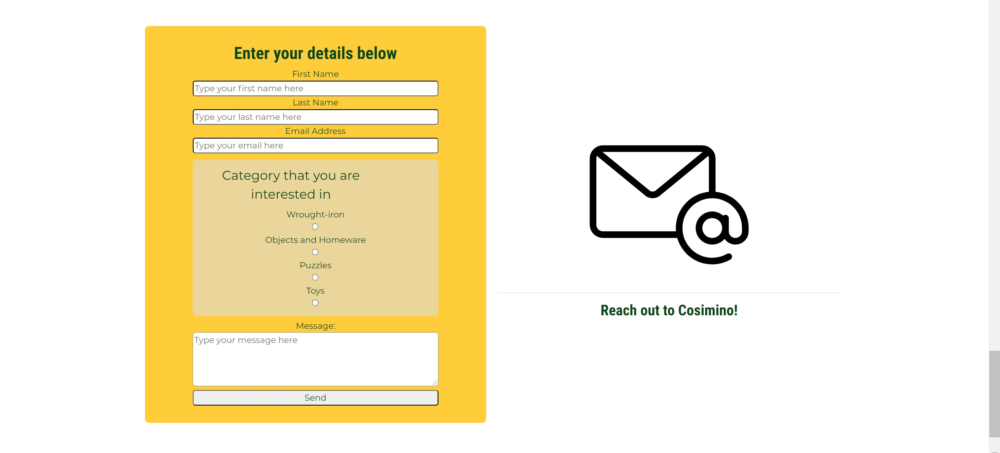
- And finally, the footer containing the social media links:
  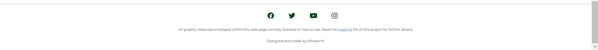

### Features Left to Implement
- A gellery page can definitely complete the user experience, given the countless works that Cosimino have created
- A carousel within the main page
- A "Back to the top" button to let the user navigate faster within the contents of the same page
- An embedded google maps frame (showing a fictional location)
- clearer and more concise/catchy language
***
## Technologies

* HTML
  - This project uses HTML as the main language used to complete the structure of the Website.
* CSS
  - This project uses custom written CSS to style the Website.
* [Bootstrap](https://getbootstrap.com/docs/5.1/getting-started/introduction/) 5.1.3
  - Given the past experience with Bootstrap, I have used it as main technology to define a responsive behaviour among the several sections. The Bootstrap Grid system and the navigation bar have been easily designed thanks to the pre-set features coming from bootstrap, even though most of time both layout and style have been overridden by custom CSS code. I am in fact fully aware of the underlying Bootstrap features. Please, notice the responsive sections manually designed with custom CSS and flexboxes.
* [Font Awesome](https://fontawesome.com/)
  - Font awesome Icons are used for the Social media links contained in the Footer section of the website.
* [Google Fonts](https://fonts.google.com/)
  - Google fonts are used throughout the project to import the aforementioned fonts, with specific font-sizes, through the @import instruction at the top of the custom CSS file.
* [Replit](https://replit.com/@FredM2)
  - ** Replit is the Integrated Development Environment used to develop the Website. After the first commit via gitHub, the following ones have been triggered via Replit shell. As for permissions, gitHub only required to generate a token to push, which I have stored locally in the "Secrets (Environmental Variables)" area. FredM2 is my username and Replit signature. **
* [GitHub](https://github.com/aelfrith92)
  - GithHub is the hosting site used to store the source code for the Website and [Git Pages](https://pages.github.com/) is used for the deployment of the live site.
  - Past personal projects have been used to get inspiration for the current milestone project. 
* [Git](https://git-scm.com/)
  - Git is used as version control software to commit and push code to the GitHub repository via Replit, where the source code is stored.
* [GIMP](https://www.gimp.org/)
  - Gimp is used to convert, scale, and reduce the file sizes of images before being deployed to reduce storage and bandwidth.
* [Google Chrome Developer Tools](https://developers.google.com/web/tools/chrome-devtools)
  - Google chrome built-in developer tools are used to inspect page elements and help debug issues with the site layout and test different CSS styles. In particular, it came handy when troubleshooting layout and boxes.
* [CSS Generator](https://cssgenerator.org/rgba-and-hex-color-generator.html)
  - This was used to convert the RGBA colour for the site to Hex. 
* [Flaticon](https://www.flaticon.com/)
  - Flaticon has been used as main icon repository.
* [Colorhunt.co](https://colorhunt.co/)
  - Colorhunt has been used to identify the best color palettes and shades
* [Wood-database](https://www.wood-database.com/)
  - Wood-database has been used to retrieve part of the wood textures implemented in the categories sections.
* [Mentor's read.me template](https://github.com/Daisy-McG/MilestoneProject-1/blob/master/README.md)
  - This read.me file has been drafted following the advice returned by the mentor, as well as following suggestions released on the course modules.
***
## Testing

### Test Strategy 

#### Summary 

Testing is required on MilestoneProject-1 – Cosmo's Drawing.

- As this project is static and contains no back-end functionality, the testing performed will be on the visual effects and layout of the Website. Testing to be done on at least three web browsers (Google Chrome, Apple Safari, Mozilla Firefox) and all screen sizes.

- No elements should overlap another container div.

- All nav links should direct to the correct html relative references within the page, as per their names.

- All links to external websites must open in a new browser.

- Testing of form validation will also be required to ensure the correct inputs are taken and that all fields are required.

- Code validation tools for [HTML](https://validator.w3.org/) and [CSS](https://jigsaw.w3.org/css-validator/)

- [Lighthouse](https://developers.google.com/web/tools/lighthouse) tool by Google Chrome

- [Wave](https://wave.webaim.org/) - Google Chrome plug-in to test common code errors and warnings, which encompass accessibility features and best practices.

- The live Project can be found [here](https://aelfrith92.github.io/cosmo-s-artworks/).

### Test Results
- The animation, links, images, Bootstrap layouts, custom layouts of containers behaved as expected on 3 different browsers.
- No overlapping detected.
- Nav links and external links behave as expected.
- Form validation returns all variables correctly assigned to each HTML "name" attributes
- Code validation returned no errors 
- Lighthouse returned the following outcome
    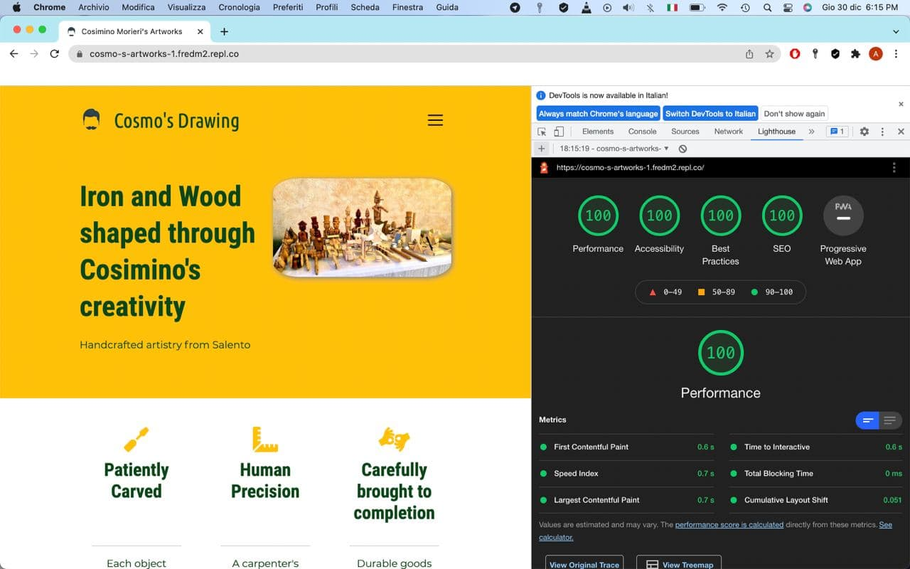
- Wave returned the following outcome
  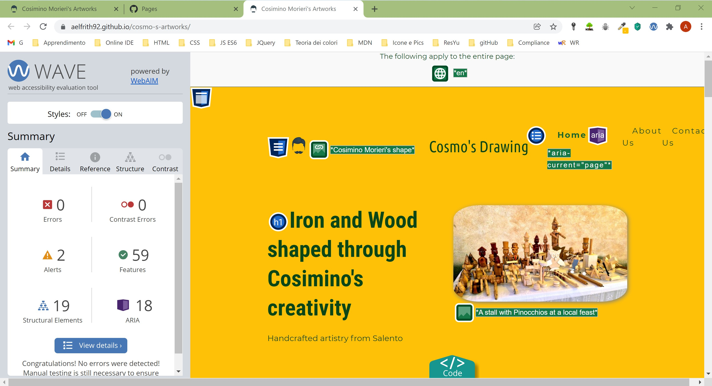
  The only 2 alerts returned concerned the too-small texts at the bottom of the page, which I have not changed, as it is meant as secondary content for other targets, aware of such formalities.
  

### Issues and Resolutions to issues found during testing
* Indentation
  - Even though aware of the indentation issues in the HTML and CSS files, each time that I have tried to push the correct versions, files on gitHub does not mirror the actual appearance on Replit. See a comparison as follows:
  	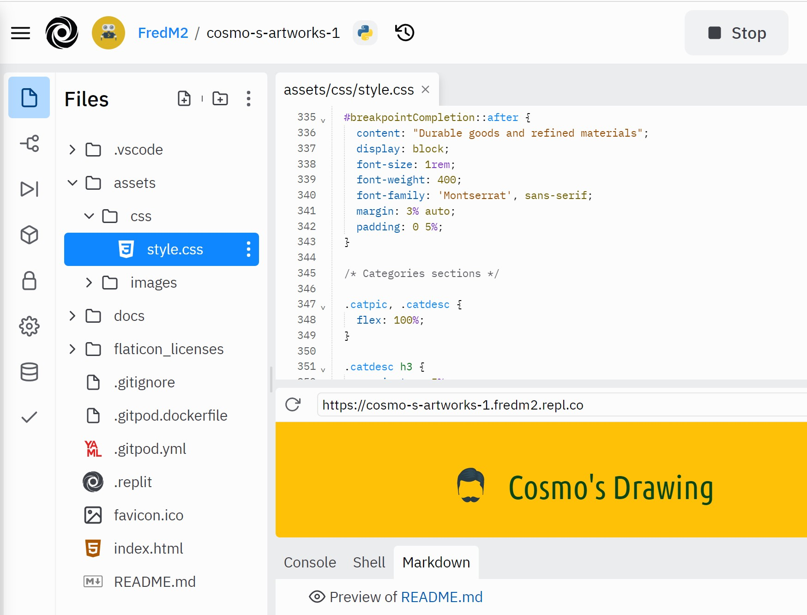 
		VS 
		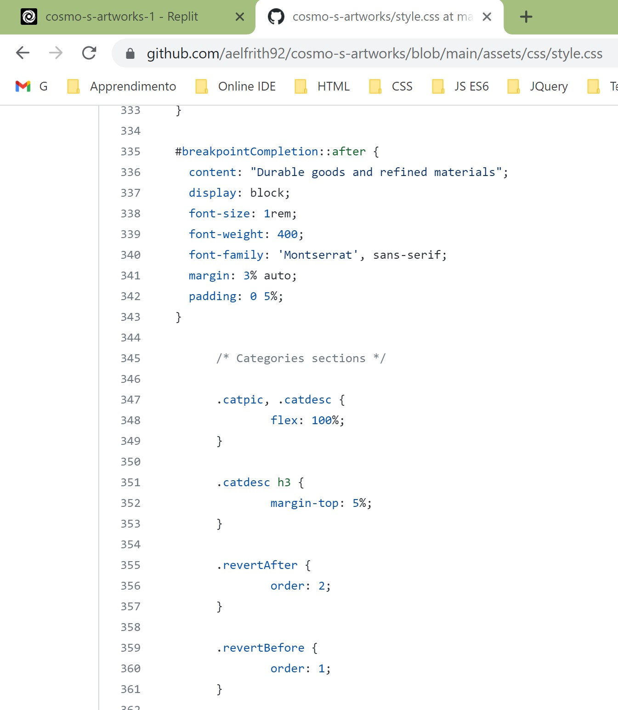

* Radio inputs alignment in the contact form does not mirror expectations on Apple Safari, as they are aligned to the left, instead of center as on Chrome and Firefox. I have tried with compatible alternatives (-webkit-), but it did not work. Find a screenshot of the issue as follows:
  - 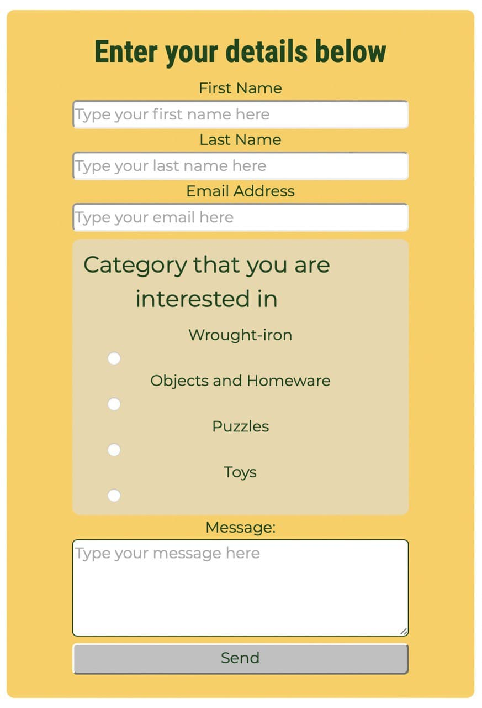
 
* The Toggler Button in the navigation menu came with a bug, only if the warning theme is selected. More specifically, the button is presented without the 3 parallel lines. To solve this issue, I have included an svg file which resembles the 3 lines. However, it still goes off the expected layout when the viewport is super narrow (in fact, the bug only shows up if you open the Chrome dev tools, otherwise the ordinary, minimum width does not reveal this issue). Find a comparison below:
  - ordinary viewport:
    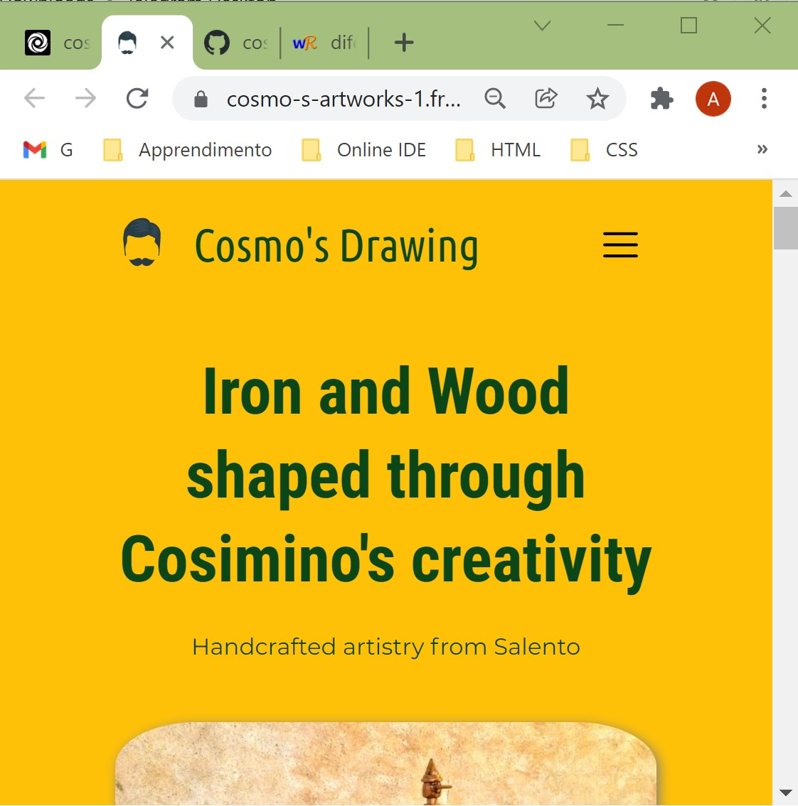
  - unexpected responsive behaviour:
    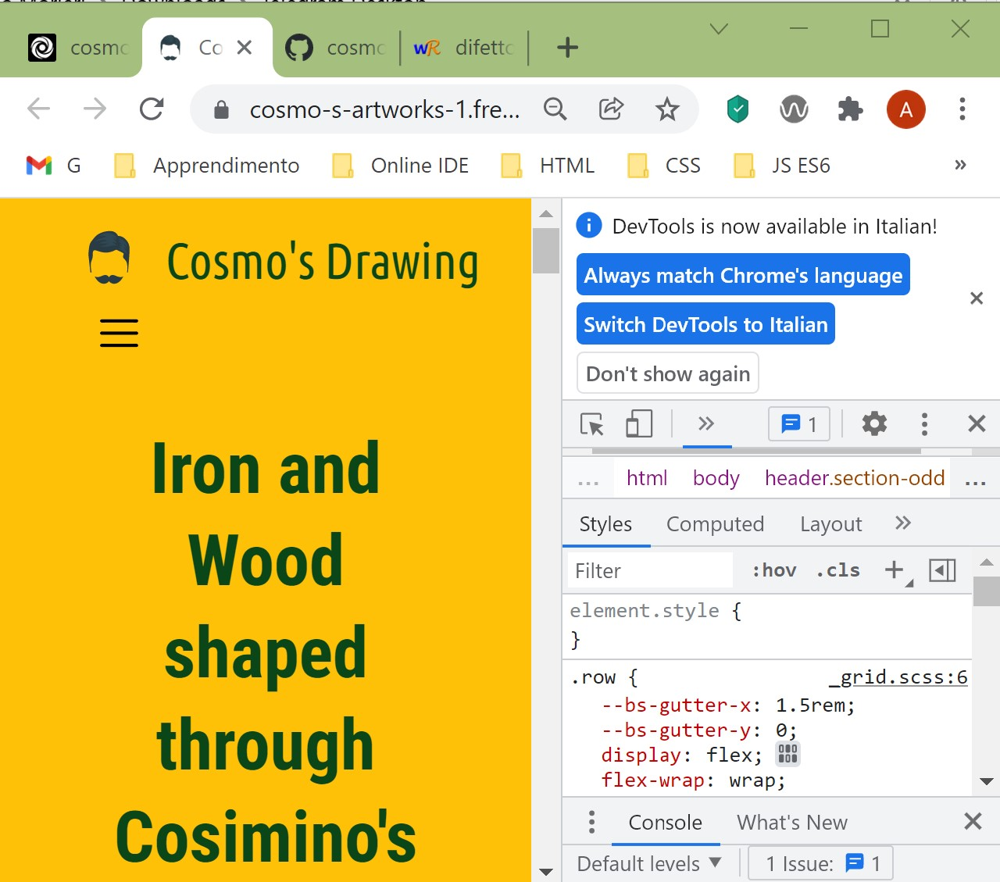

* Generally speaking, layout problems were the most frequent ones. I have overcome them by adopting an essential approach: creating containers without contents first, in order to test their behaviour. Adding content once containers behaved as expected.

* Images size affected the performance of the page. Re-scaling and converting all of them to webp solved most of the issues.

* The categories pictures were initially overlapped by other containers. I have solved this issue by editing their dimensions and by adding padding and margins to create a sort of frame, which does not catch the user's attention as it would do.

* Centering in all containers has been troubleshot by using flexboxes, justify-content, align-itmes
***
## Deployment

### Project Creation
The project was started by navigating to the [template](https://github.com/Code-Institute-Org/gitpod-full-template) and clicking 'Use this template'. Under Repository name I input "cosmo-s-artworks" and checked the Include all branches checkbox. I then navigated to the new [repository](https://github.com/aelfrith92/cosmo-s-artworks). 

Having Replit as main and only IDE, I went to my [Replit account](https://replit.com/@FredM2) and I have created a new Repl by pulling the repository from gitHub. 

The bash terminal within the Replit UI was already able to trigger commands like:

* git status - This command was used to check the status of edited files ready to be added to the staging area
* git add *.* - This command was used to add edited files to the staging area
* git commit -m *commit message explaining the updates* - This command was used to commit changes to the local repository
* git push - This command was used to push all commited changes to the GitHub repository  

** However **, for each push, I had to define my username and push token, retrieved by following the steps described at [this page](https://docs.github.com/en/authentication/keeping-your-account-and-data-secure/creating-a-personal-access-token).

** Moreover **, in order to deploy the content within the Replit environment each time, I have used the handy feature provided by Replit and concerning the .replit file. By defining 2 lines of code in it, namely the command and the language, I was able to trigger "python3 -m http.server" by just hitting the **Run** button at the top.

### Deploying the project with Github Pages
1. Navigate to the GitHub [Repository](https://github.com/aelfrith92/cosmo-s-artworks)
1. Click the 'Settings' Tab.
1. Scroll Down to the Git Hub Pages menu item on the left.
1. Select 'Master Branch' as the source.
1. Click the Save button.
1. Click on the link to go to the live deployed page.

### Run Locally
1. Hit on the **Run** button at the top

***
## Credits
### Code
- Images respnsiveness https://www.w3schools.com/howto/howto_css_image_responsive.asp
- W3schools has been the main source of knowledge
- My mentor, Daisy McGirr, also suggested to pay attention to responsiveness, accessibility features, indentation, **commit signatures**.
### Content
- Wood textures come from visual resources available at https://www.wood-database.com/
- Icons retrieved from both fontawesome and flaticon
- General design ideas inspired by Angela Yu, founder of https://www.appbrewery.co/
- Cosimino Morieri himself, as source of his own works and related photos

### Media
All graphis materials are fully licensed or free-to-use.

### Acknowledgements

I'd like to thank my mentor Daisy McGirr for his guidance throughout my project. 

## Comments
## **Git commits are showing up as two contributors, one as Alfredo Morieri (gitHub username: aelfrith92) and one verified as FredM2 (my replit username). This was caused by pushing without setting a signature for commits from replit. All commits were pushed by Alfredo Morieri.**