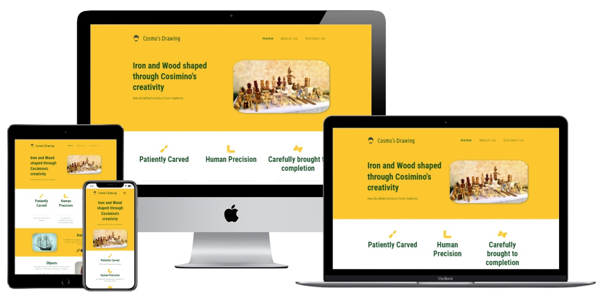

## Table of Contents
* [Purpose](#Purpose)
* [User Experience Design (UX)](#User-Experience-Design)
  * [User stories](#User-Stories)
    * [First Time Visitor Goals](#First-Time-Visitor-Goals)
    * [Returning Visitor Goals](#Returning-Visitor-Goals)
  * [Structure](#Structure)
  * [Design](#Design)
    * [Colour Scheme](#Colour-Scheme)
    * [Typography](#Typography)
    * [Imagery](#Imagery)
    * [Wireframes](#Wireframes)
    * [Differences to Design](Differences-to-Design)
* [Limitations](#Limitations)
- [Features](#Features)
    * [Existing Features](#Existing-Features)
    * [Future Features](#Features-Left-to-Implement)
* [Technologies](#Technologies)
* [Testing](#Testing)
    * [Test Strategy](#Test-Strategy)
      * [Summary](#Summary)
      * [High Level Test Cases](#High-Level-Test-Cases)
      * [Out of Scope](#Out-of-Scope)
    * [Test Results](#Test-Results)
    * [Testing Issues](#Issues-and-Resolutions-to-issues-found-during-testing)
* [Deployment](#Deployment)
    * [Project Creation](#Project-Creation)
    * [GitHub Pages](#Using-Github-Pages)
    * [Locally](Run-Locally)
* [Credits](#Credits)
  * [Content](#Content)
  * [Media](#Media)
  * [Acknowledgements](#Acknowledgements)
  * [Comments](#Comments)

# Milestone Project 1
## Purpose
The website is meant to present and show off my father's craftsmanship to everybody. At the same time, it has been created for the sole purpose of completing the first Milestone Project for the Code Institute's Full Stack Developer course.
The knowledge gained from the HTML, CSS, and User Centric Design modules played a key role in developing the web page, even though a full list of the employed technologies can be found in the technologies section of this document.

The live website can be found [here](https://aelfrith92.github.io/cosmo-s-artworks/).

## Cosmo's Drawing - Responsive Website

My father - Cosimino Morieri, the client - always wished he had a personal website, to showcase his works to friends and acquaintances. As I had already developed fully responsive websites in the past, I started coding bearing the responsiveness in mind. There is no profit purpose behind this web page. The website will provide an essential overview about his works (what he does) and his background. 

*** 
## User Experience Design

### User stories
#### First Time Visitor Goals
* As a First Time user, I want to easily understand the main purpose of the site and learn more about the artist.
* As a First Time user, I want to be able to easily navigate throughout the site to find content.
* As a First Time user, I want to view the website and content clearly on my mobile device.
* As a First Time user, I want to find ways to follow Cosimino's activities on different social media platforms.
#### Returning Visitor Goals
* As a Returning user, I want to share the content with friends and have a look at the gallery (to be implemented in the future).
* As a Returning user, I want to contact Cosimino, so I can request more information.

### Structure
The site contains just one single page for the time being. A gallery page will be added in the future, as the visual resources need a format conversion, in order to optimize data streaming and performance.
The Navigation Menu allows users to easily navigate the different sections of the web page, even on smaller devices thanks to the responsive and collapsable version of the same.
The purpose of this is to fulfill the aforementioned user's story:
> As a First Time user, I want to be able to easily navigate throughout the site to find content.

The Home Page contains a brief overview about Cosimino's background.
The purpose of this is to fulfill the aforementioned user's story:
> As a First Time user, I want to easily understand the main purpose of the site and learn more about the artist.

Custom CSS and Bootstrap 5.1.3 will be employed to make the Website responsive by the use of media queries, the Boostrap Grid system, and flexboxes CSS properties. All sections contain code that overrides Bootstrap pre-set style.

All pages (as well as the future gallery page) will be responsive. There is just one chosen layout breakpoint, which triggers the alternative views of contents, namely, 768px as maximum width. 
Images have been converted, scaled, and included in the code so that they are accessible and light, in terms of data streaming and performance. A minimum height and a responsive width have been set, so that they are still visible even at narrow viewports.
The purpose of this is to fulfill the aforementioned user's story:
> As a First Time user, I want to view the website and content clearly on my mobile device.

All pages will contain a Footer Element with Contact Information, Event Booking and Social Media Icons. The icons used will be
from font-awesome. These are referenced below in the Frameworks-Libraries-and-Programs-Used section of this document. The event 
Booking section will not be visible on smaller devices. The aim of the Footer elements are to fulfill user stories:
> As a First Time user, I want to find ways to follow the HOTD Club on different social media platforms. 
> As a Returning user, I want to order tickets online in advance of events so that I am garanteed entry. 
> As a Returning user, I want to contact the club so I can request more information.

The About Page will contain The History of the Club, their current members, titles and personal bios. This page is to help 
implement user story:
> As a First Time user, I want to easily understand the main purpose of the site and learn more about the organisation.

The Events Page will contain information on upcoming and previous events run by the Club. There will be a booking form 
connected to this page. 
The purpose of this is to fulfull user stories:
> As a Returning user, I want to order tickets online in advance of events so that I am garanteed entry. 
> As a Frequent user, I want to check to see if there are any new upcoming events.

The Gallery Page will contain several Galleries with 8 photographs in each from various activities the club has engaged in.
The purpose of these galleries are to fulfill user story:
> As a Frequent user, I want to check to see if there are any new photos and media from the clubs activities.

The Contact Page will contain a form that can be used to contact the Club through the website. This will also contain a check 
box that will allow the user to sign up for the Clubs newsletter in order to keep up to date with the club.
The purpose of this Page is to fulfill user stories:
> As a Returning user, I want to contact the organisation so I can request more information. 
> As a Frequent user, I want to sign up to the Newsletter so that I am emailed any major updates and/or changes to the website or organisation.

Throughout the desktop version of the website there will also be an alert at the top of all pages except the Events Page. This
can be engaged with by the user. The resulting action will open up a modal form to allow the user to book event tickets.
### Design
#### Colour Scheme
The two main colours used are Green  and an off shade of Black  as these colours are similar to the clubs colours. A darker shade of green was picked than what is currently on the logo as the site would be too bright with the main colour. The darker green and off black shade should compliment each other without being over powering to the eyes.
#### Typography
The headers on all pages throughout the Website are using the **Libre Baskerville** font while the main text is using the **Cabin** font. 
#### Imagery
Brand is important to HOTD and they have provided their own Logo to be used in the Nav section of the website that will be displayed at all
times no matter the device. The size and placement may vary dependant on screen size. Photo's of club members and events will be present throughout the Website. These images have been provided by the club's found Ronnie Robinson.
#### Wireframes
Home Page 
 
About Page 
 
Event Page 
 
Gallery Page 
 
Contact Page 
 

For full side PDF's of the wireframes, please click the links below
* [Home Page Wireframe](assets/wireframes/home.pdf)

* [About Page Wireframe](assets/wireframes/about.pdf)

* [Events Page Wireframe](assets/wireframes/events.pdf)

* [Gallery Page Wireframe](assets/wireframes/home.pdf)

* [Contact Page Wireframe](assets/wireframes/home.pdf)

#### Differences to Design
In the original design, the Event section of the footer was to be hidden on smaller mobile devices to ensure adequate space and positioning. This was not implemented in the end as there was space to include it on all screen sizes.
### Limitations
Due to no JavaScript functionality, apart from Bootstraps(JS/JQuery) used for the Modal Form as outlined in the Frameworks Libraries and 
Programs Used section, the contact forms will not store data or send email requests.
***
## Features
 
### Existing Features
- Alert on Desktop view (Alert present on index.html, about.html, gallery.html, contact.html) - This alert allows users to Book event tickets by opening up a modal form.
- Booking button on the events.html page opens up the booking modal form (The same one as the alert)
- Contact Form - This can be completed on the contact.html page and used in order to contact the club with any queries users may have.
- Carousel Gallery - There are 4 carousel sliders within the Website. One is on the Event Page displaying a few slides from a successfull fundraiser for Lifeline Inishowen. The remaining three are on the Gallery Page and are only displayed on small screen sizes to prevent the need for excessive scrolling.
- Embedded YouTube video - This past event video can be turned on/off by the user. It is not set to automatically run.

### Features Left to Implement
- Users would like to have a forum incorporated into the Website. This feature was not implemented as part of the initial release but will be addressed in a future.
- In order to implement the use of the proposed forum, signup and logins would have to be added.
***
## Technologies

* HTML
	* This project uses HTML as the main language used to complete the structure of the Website.
* CSS
	* This project uses custom written CSS to style the Website.
* [Bootstrap](https://getbootstrap.com/)
	* The Bootstrap framework is used throughout this website for layouts and styling. The car
	* This has also been used to import JavaScript/Query used for the pop up Event booking modal
* [Font Awesome](https://fontawesome.com/)
	* Font awesome Icons are used for the Social media links contained in the Footer section of the website.
* [Google Fonts](https://fonts.google.com/)
	* Google fonts are used throughout the project to import the *Libre Baskerville* and *Cabin* fonts.
* [Visual Studio Code](https://code.visualstudio.com/)
	* VS Code is the Integrated Development Environment used to develop the Website.
* [GitHub](https://github.com/)
	* GithHub is the hosting site used to store the source code for the Website and [Git Pages](https://pages.github.com/) is used for the deployment of the live site.
* [Git](https://git-scm.com/)
	* Git is used as version control software to commit and push code to the GitHub repository where the source code is stored.
* [TinyJPG](https://tinyjpg.com/)
	* TinyJPG is used to reduce the file sizes of images before being deployed to reduce storage and bandwith.
* [Google Chrome Developer Tools](https://developers.google.com/web/tools/chrome-devtools)
	* Google chromes built in developer tools are used to inspect page elements and help debug issues with the site layout and test different CSS styles.
* [balsamiq Wireframes](https://balsamiq.com/wireframes/)
	* This was used to create wireframes for 'The Skeleton Plane' stage of UX design.
* [MS PAINT](https://support.microsoft.com/en-us/windows/get-microsoft-paint-a6b9578c-ed1c-5b09-0699-4ed8115f9aa9)
    * The dropper tool is this program was used against the Site logo to determine the exact shade of green to be used.
* [CSS Generator](https://cssgenerator.org/rgba-and-hex-color-generator.html)
    * This was used to convert the RGBA colour for the site to Hex. 
* [Favicon](https://favicon.io/)
    * Favicon.io was used to make the site favicon 
* [Techsini](http://techsini.com/multi-mockup/index.php)
    * tecnisih.com Multi Device Website Mockup Generator was used to create the Mock up image in this README
* [placehold.it](https://placehold.it)
    * placehold.it was used to display the colours shown in the Color Scheme section.
***
## Testing

### Test Strategy 

#### Summary 

Testing is required on MilestoneProject-1 – Hair O’ The Dog MCC Responsive Website.

As this project is static and contains no back-end functionality, the testing performed will be on the visual effects and layout of the Website. Testing to be done on at least three web browsers and all screen sizes.

No elements should overlap another container div. All elements should remain on the screen at all sizes above 300px. All carousel items should be controllable with the mouse as well as sliding on a timer. 

All nav links should direct to the correct html pages as per their names. The Home page is the exception, this one will redirect to index.html. 

All links to external websites must open in a new browser.

Testing of form validation will also be required to ensure the correct inputs are taken and that all fields are required. 

Validation of inclusion for all features included in the Structure of the Website / Wireframes must be performed.

The live Project can be found [here](https://daisy-mcg.github.io/MilestoneProject-1/index.html). 
#### High Level Test Cases 

#### Out of Scope  

* Testing form validation for phone number is out of scope. No Reg-Ex has been implemented so this will take a string value. 

### Test Results
 
Testing results can be found [here](assets/test-results/test-results.xlsx) 
Please note these results are a .xlsx file and will require excel, google docs or compatiable program to open the file. 
All Pages were run through the [W3C HTML Validator](https://validator.w3.org/) and showed no errors. 
CSS Stylesheet was run through the [W3C CSS Validator](https://jigsaw.w3.org/css-validator/validator) and showed no errors. 
Website was tested by running locally and tested on the deployed version. No differences found.

* As a First Time user, I want to easily understand the main purpose of the site and learn more about the organisation. - Testing was performed to ensure Club information was displayed on the Home Page.
* As a First Time user, I want to be able to easily navigate throughout the site to find content. - Testing was performed on all Navigation links to ensure users can easily navigate the Website.
* As a First Time user, I want to view the website and content clearly on my mobile device. - Testing was performed to ensure the Website was responsive on all devices.
* As a First Time user, I want to find ways to follow the HOTD Club on different social media platforms. - Testing was performed to ensure Social Media links had been added to the Website.

* As a Returning user, I want to order tickets online in advance of events so that I am garanteed entry. - Testing was performed to ensure the Booking Modal(Alert on the top of Pages and Booking Button on Events Page) was functioning throughout the Website.
* As a Returning user, I want to contact the organisation so I can request more information. - Testing was done to ensure there was a contact form on the Website and that the Footer also contained contact information.

* As a Frequent user, I want to check to see if there are any new upcoming events. - Testing was done to ensure upcoming events were displayed on the Events Page.
* As a Frequent user, I want to check to see if there are any new photos and media from the clubs activities. - Testing was performed to ensure a gallery had been added with photos from the clubs activities.
* As a Frequent user, I want to sign up to the Newsletter so that I am emailed any major updates and/or changes to the website or organisation. - Testing was performed to validate a checkbox had been added to the contact form allowing users to sign up for the Club newsletter.

### Issues and Resolutions to issues found during testing
* Clicking the logo doesn't redirect to home page. This was resolved by updating the href on all Pages.
* Photo alignment issue on Home Page, this was fixed by adding bootstrap classes d-flex align-items-center and img-fluid.
* YouTube video on Events page was causing overlapping on small screens due to having a fixed size. This was resolved by removing fixed width and height and setting img-fluid in the div.
* Navigation menu items were being covered on smaller screens due to amount of items and text not shrinking. This was resolved by adding a media query between min width 576px and max width 654px that changes to a smaller font size.
* Spelling mistakes were found when proof reading, these were corrected.
* About page Meet the member section photos and text were overlapping on medium and below screens. This was fixed by correcting column sizes and adding class member-alignment with corresponding css styling.
* On extra wide screens content was being stretched across the entire width of the screen. This was fixed by changing container-fluid to container.
* Modal Booking form was accepting any inputs in fields. This was resolved by adding the required attribute to all fields.
* Carousel on Events page was expanding the full width of the screen, this was causing the images to be distorted and strected. This was resolved by by adding a maximum height and width to the containing div.
* On the Gallery page, the HR was sitting beside the title on large and medium screen sizes. This was resolved by wrapping the titles into a a div and assigning col-12 class.
***
## Deployment

### Project Creation
The project was started by navigating to the [template](https://github.com/Code-Institute-Org/gitpod-full-template) and clicking 'Use this template'. Under Repository name I input MilestoneProject-1 and checked the Include all branches checkbox. I then navigated to the new [repository](https://github.com/Daisy-McG/MilestoneProject-1). I then clicked the Code drop down and selected HTTPS and copied the link to the clipboard.

Opening a bash terminal in Visual studio code I then typed git clone [link from clipboard](https://github.com/Daisy-McG/MilestoneProject-1.git) followed by open folder and navigating to the newly created local repository. The following commands were used throughout the project:

* git add filename - This command was used to add fils to the staging area before commiting.
* git commit -m *commit message explaining the updates* - This command was used to to commit changes to the local repository.
* git push - This command is used to push all commited changes to the GitHub repository. 

### Using Github Pages
1. Navigate to the GitHub [Repository:](https://github.com/Daisy-McG/MilestoneProject-1)
1. Click the 'Settings' Tab.
1. Scroll Down to the Git Hub Pages Heading.
1. Select 'Master Branch' as the source.
1. Click the Save button.
1. Click on the link to go to the live deployed page.

### Run Locally
1. Navigate to the GitHub [Repository:](https://github.com/Daisy-McG/MilestoneProject-1)
1. Click the Code drop down menu.
1. Either Download the ZIP file, unpackage locally and open with IDE (This route ends here) OR Copy Git URL from the HTTPS dialogue box.
1. Open your developement editor of choice and open a terminal window in a directory of your choice.
1. Use the 'git clone' command in terminal followed by the copied git URL.
1. A clone of the project will be created locally on your machine.

***
## Credits
### Code
The code to style the check-box background color was taken from the comments of [Stackoverflow post](https://stackoverflow.com/questions/24322599/why-cannot-change-checkbox-color-whatever-i-do)
### Content
The content of this software was created by Daisy McGirr based upon discussions with Ronnie Robinson, Hair O' The Dog MCC.

### Media
The photos and video used in this video are property of Hair O' The Dog MCC. Permission was granted to use all media files by Ronnie Robinson, club Founder.
The YouTube video on the events page is property of Marijus Ltu. Permission was obtained to use this video.

### Acknowledgements

I'd like to thank my mentor Spencer Baribell for his guidance throughout my project. 
Thanks to fellow classmate @Jay Bradley for helping me figure out how to link my TOC to headings with spaces. 
I'd like to give a special mention to past students Anthony and Mr_Bim_alumni who guided me and helped me learn to debug with developer tools whenever I faced alignment issues with my Website. 

## Comments
Git commits are showing up as two contributors, one as Your Name and one verified as Daisy-McG. This was caused by pushing without setting a signature for commits from VS Code, a signature was added on 25/10/2020 and all new commits are now verified. All commits were pushed by Daisy McGirr.